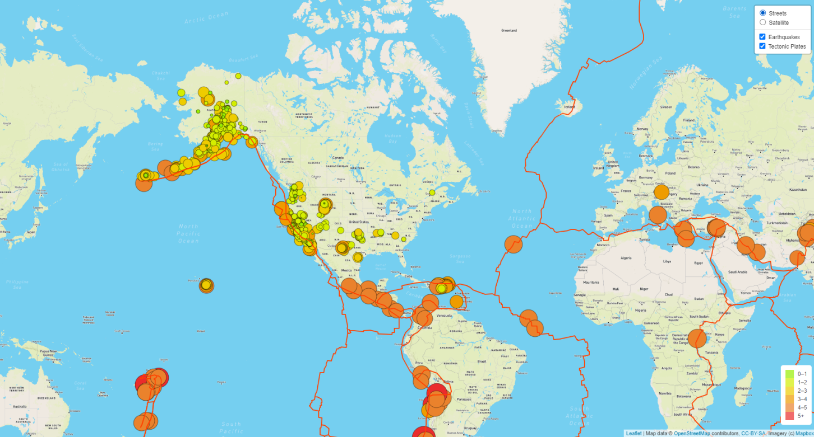
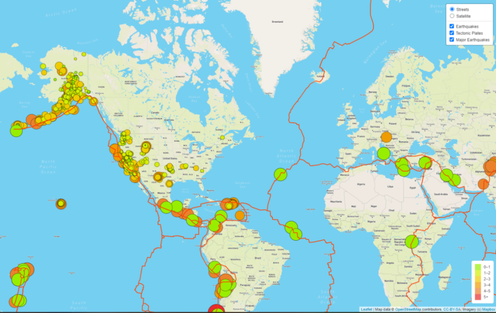
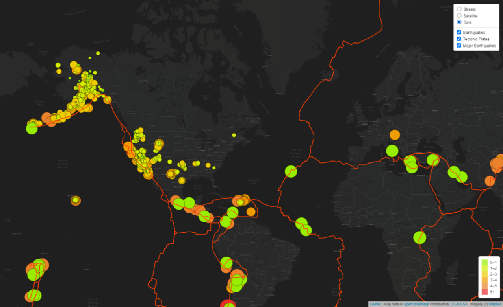

# Mapping_Earthquakes

### Project Overview
I have just started in a new position as a Data visualization Specialist for the Disaster Reporting Network a non-profit that provides data-driven visualizations on disasters around the world. I have been tasked to build an interactive data visualization, that will be compatible for use on desktop and mobile phones, of earthquakes around the world using the latest earthquake GeoJSON data.

### Resources
- Data Source: [Realtime notification of Earthquakes](https://earthquake.usgs.gov/ "USGS homepage"), [Tectonic Plates](https://github.com/fraxen/tectonicplates/blob/master/GeoJSON/PB2002_boundaries.json), [Major Earthquakes](https://earthquake.usgs.gov/earthquakes/feed/v1.0/summary/4.5_week.geojson)
- Languages: HTML, JavaScript, CSS
- Software: Atom 1.63.1, Visual Studio Code 1.74.1, Google Chrome v 111.0.5563.147

### Results

##### Tectonic Plate Map

##### Major Earthquakes Map

##### Third Background Tile

### Summary
The user now has an option to view their earthquake map with three different backgrounds: Street, Satellite, or Dark mode. In addition, they have three filters that the can turn on and off as they please: all earthquakes, tectonic plates, and major earthquakes.

If the user is specifically wanting to see the information for the most major earthquakes they can deselect the earthquake check box, red and orange circles indicate a magnitude of 6.0 and 5.0 or higher respectively, green will be a magnitude below 5. If the user is overwhelmed with everything on the map they can also turn off the tectonic plate layer.
